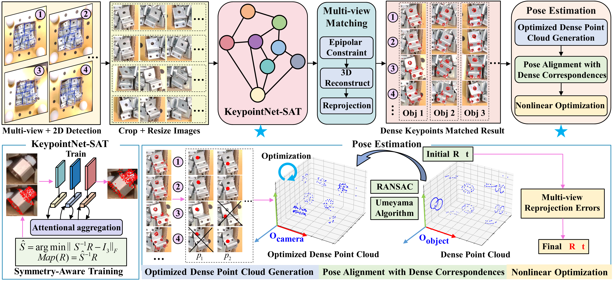
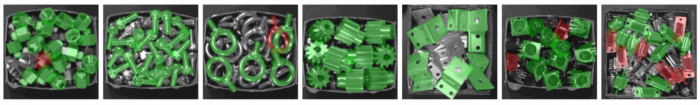
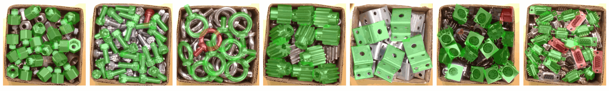

<h2 align="center">DKPMV</h2>

<p align="center">
  <a href="https://arxiv.org/abs/2510.10933">
    
  </a>
</p>

## 🧩 Introduction
**DKPMV** This paper proposes DKPMV, a novel multi-view RGB pipeline for 6D pose estimation of textureless objects, which achieves dense keypoint-level fusion without relying on depth input. Leveraging three-stage progressive optimization, Att, and SAT, our method effectively captures multi-view geometric cues.

### 🛠️ Pipeline Architecture


---

## 🔍 Qualitative Results

<p align="center">
  
  <br>
  
  <br>
</p>

---
## 📺 Demo Video
<p align="center">
  <a href="https://youtu.be/hcAhZ3SW2p8">
    
    <br>
    <sub>点击上方图片跳转至 YouTube 观看完整演示视频</sub>
  </a>
</p>


## 📅 Roadmap / TODO
We are working on cleaning up the code for public release. Stay tuned!

- [ ] **Release Inference Code** (Coming Soon 🚀)
- [ ] **Release Pre-trained Models**
- [ ] **Release Training Scripts**
---

***
If you find our work useful, please cite it as follows: 
```bibtex
@article{chen2025dkpmv,
  title={DKPMV: Dense keypoints fusion from multi-view RGB frames for 6d pose estimation of textureless objects},
  author={Chen, Jiahong and Wang, Jinghao and Wang, Zi and Wang, Ziwen and Guan, Banglei and Yu, Qifeng},
  journal={arXiv preprint arXiv:2510.10933},
  year={2025}
}
```
